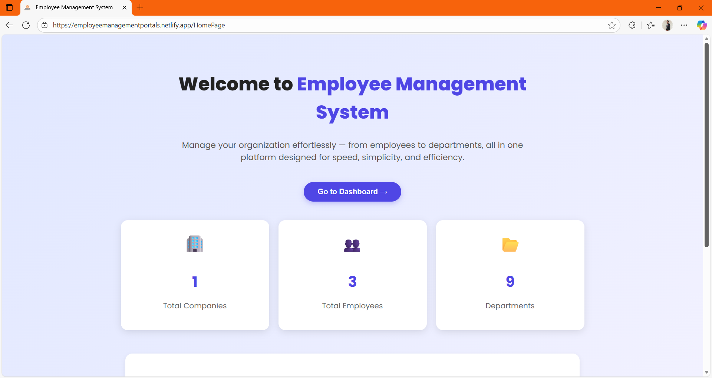
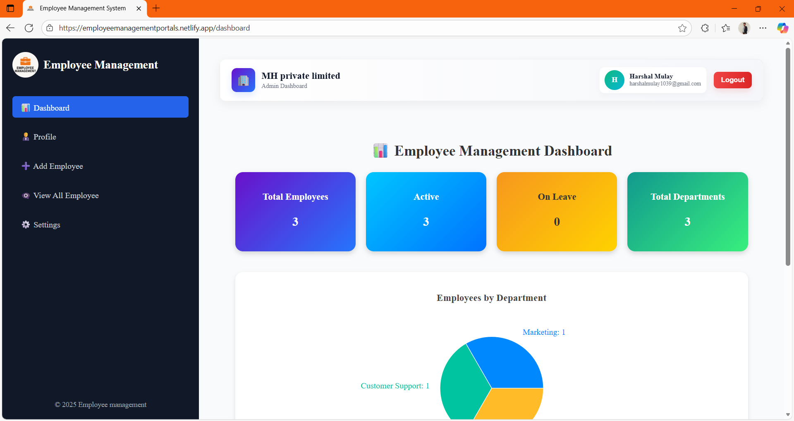
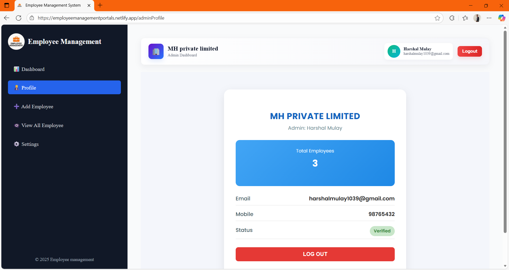
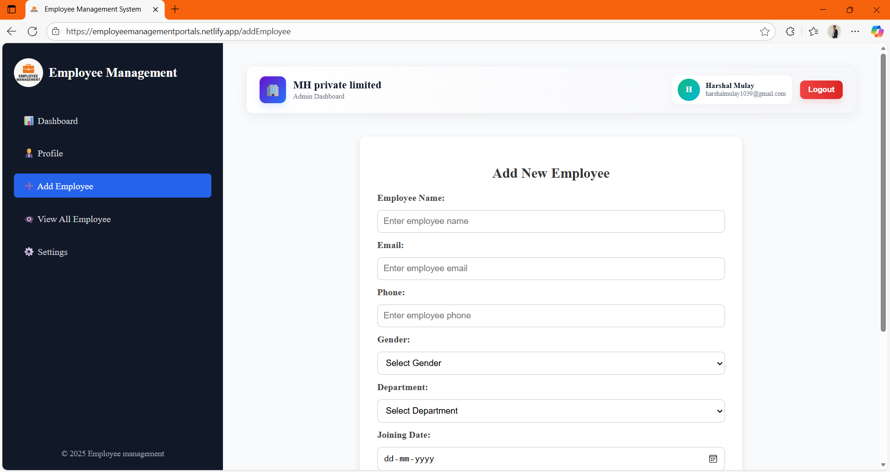
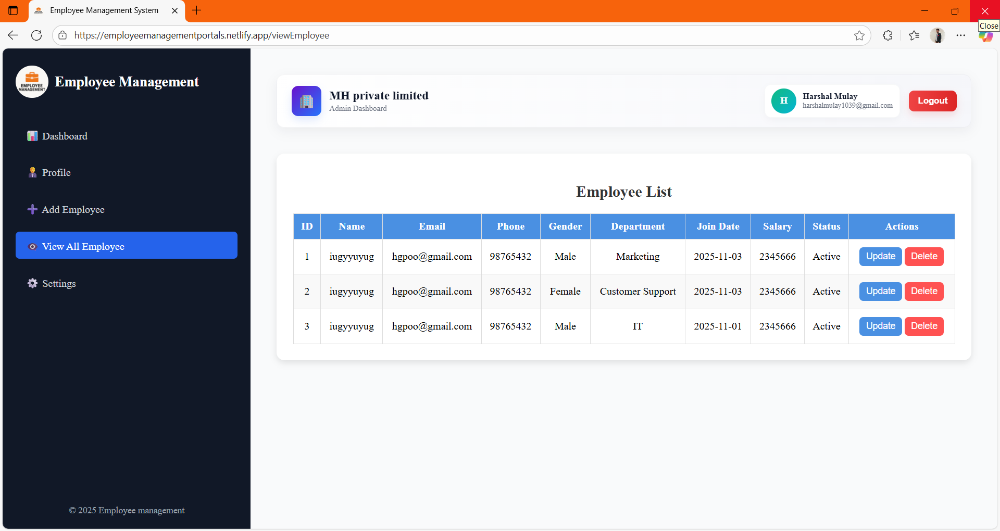
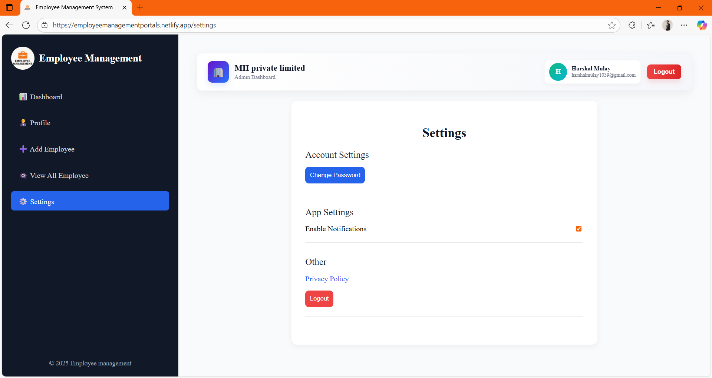

<div align="center">
# Employee Management System

<!-- #  Employee Management System  
### A Complete Full-Stack Employee Management Platform  


🔗 **Live Demo:** https://employeemanagementportals.netlify.app  
🔗 **GitHub Repository:** https://github.com/mulayharshal/Employee-Management-System  

</div>

---

## 🏆 About the Project

The **Employee Management System** is a modern full-stack web application designed for organizations to manage employees data efficiently.

It includes:

- Authentication (JWT)  
- Employee CRUD     
- Dashboard analytics  
- Email notifications  
- Modern responsive UI  

This project is perfect for **real-world usage**, **college projects**, **internship demos**, or **portfolio showcase**.

---

## 🛠️ Tech Stack

<div align="center">

| Frontend | Backend | Database | Deployment |
|---------|---------|----------|------------|
| ⚛️ React (Vite) | ☕ Spring Boot | 🗄 MySQL | 🌐 Netlify (Frontend) |
| 🎨 CSS | 🔐 Spring Security (JWT) | | ☁ Render (Backend) |

</div>

---
## 🖥️ Languages Used

- **HTML5**
- **CSS3**
- **javaScript** (for React)
- **Java** (for Spring Boot backend)
- **SQL** (for database)

---

## ✨ Features

### 🔐 Authentication & Security
- Admin Login (JWT Auth)
- Protected API Routes
- Password Encryption (BCrypt)

### 🧑‍💼 Employee Module
- Add / Edit / Delete Employees    
- Manage employee details  


### 📊 Dashboard Highlights
- Total Employees  
- Total Departments  
- Total Companies  

### ✉️ Email Service
- Login Alerts  
- OTP-ready structure  
- Supports Resend / SMTP  

### 🎨 UI Features
- Responsive frontend  
- Clean dashboard design  
- Modern forms & pages  


---

## 🚀 Getting Started

### 1. Clone the repository

```bash
git clone https://github.com/mulayharshal/Employee-Management-System.git
cd Employee-Management-System
```

### 2. Set up the Backend

```bash
cd "Backend Employee-Management"
```
- Open the project in your favorite IDE (IntelliJ IDEA, Eclipse, etc.)
- Configure MySQL database settings in `src/main/resources/application.properties`
- Run the Spring Boot application

### 3. Set up the Frontend

```bash
cd "Frontend Employee-Management"
```
- Install dependencies:

```bash
npm install
```

- Start the react:

```bash
npm run dev
```
By default, it runs at [http://localhost:5173/](http://localhost:5173/)


---

## 📸 Screenshots

### Home Page


### Admin Dashboard


### Profile Page


### Add New Employee Page


###  View All Employee Page


### Settings Page



---
## 💡 Future Enhancements

- Role-Based Authentication (Admin / Manager)
- Attendance & Leave Management
- Employee Profile Photo Upload
- Payroll / Salary Slip Module
- Admin Analytics & Reports
- PDF / CSV Export
- Dark Mode

---

👨‍💻 Developer \
Harshal Mulay \
📍 India \
🔗 GitHub: https://github.com/mulayharshal \
🌐 Live Project: https://employeemanagementportals.netlify.app

<div align="center">
⭐ If this project helped you, please give the repository a star!
</div>  -->